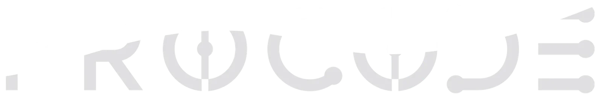

# Procode — High-Performance Digital Engineering



Procode is a premium digital engineering agency specializing in robust web ecosystems, high-performance mobile applications, and strategic IT infrastructure. This repository contains the source code for the Procode website, a modern, highly interactive, and performant web application built with cutting-edge technologies.

## 🚀 Tech Stack

This project is built using a modern, type-safe, and high-performance stack:

### Core Frameworks
- **[React 19](https://react.dev/)**: The library for web and native user interfaces.
- **[TanStack Start](https://tanstack.com/start/latest)**: Full-stack React framework leveraging TanStack Router for server-side rendering (SSR) and seamless API integration.
- **[TanStack Router](https://tanstack.com/router/latest)**: Fully type-safe routing for React.
- **[TanStack Query](https://tanstack.com/query/latest)**: Powerful asynchronous state management.

### Styling & UI
- **[Tailwind CSS v4](https://tailwindcss.com/)**: Utility-first CSS framework for rapid UI development.
- **[shadcn/ui](https://ui.shadcn.com/)**: Beautifully designed components built with Radix UI and Tailwind CSS.
- **[Lucide React](https://lucide.dev/) & [React Icons](https://react-icons.github.io/react-icons/)**: Comprehensive icon libraries.

### Animations & 3D
- **[GSAP](https://gsap.com/)**: Professional-grade animation library for complex, high-performance animations and scroll-linked effects.
- **[Framer Motion](https://www.framer.com/motion/)**: Declarative animations for React.
- **[Lenis](https://lenis.studiofreight.com/)**: Smooth scroll library for fluid and immersive scrolling experiences.
- **[Three.js](https://threejs.org/) & [React Three Fiber](https://docs.pmnd.rs/react-three-fiber)**: 3D rendering and WebGL scenes natively in React.

### Forms & Validation
- **[React Hook Form](https://react-hook-form.com/)**: Performant, flexible, and extensible forms.
- **[Zod](https://zod.dev/)**: TypeScript-first schema declaration and validation.

### Deployment & Tooling
- **[Vite](https://vitejs.dev/)**: Next-generation frontend tooling.
- **[Cloudflare Pages/Workers](https://workers.cloudflare.com/)**: Edge network deployment configured via `@cloudflare/vite-plugin`.
- **TypeScript**: Strict type checking for reliable code.

## 📁 Project Structure

```text
nexora/
├── public/                 # Static assets (images, icons, etc.)
│   └── _routes.json        # Cloudflare routing configuration
├── src/
│   ├── components/         # Reusable React components (UI, sections, layout)
│   │   ├── ui/             # shadcn/ui generic components
│   │   └── ...             # Feature-specific components (Hero, About, etc.)
│   ├── hooks/              # Custom React hooks
│   ├── lib/                # Utility functions and library wrappers (e.g., gsap.ts)
│   ├── routes/             # TanStack Router file-based routing
│   ├── content.json        # Centralized copy and content for the website
│   ├── router.tsx          # TanStack Router configuration
│   ├── server.ts           # SSR Server entry point for Cloudflare deployment
│   ├── start.ts            # Client-side entry point
│   └── styles.css          # Global CSS and Tailwind directives
├── vite.config.ts          # Vite configuration
├── package.json            # Dependencies and scripts
└── tsconfig.json           # TypeScript configuration
```

## 🛠️ Getting Started

### Prerequisites
- [Node.js](https://nodejs.org/) (v18 or higher)
- npm, yarn, pnpm, or bun

### Installation

1. Clone the repository:
   ```bash
   git clone <repository-url>
   cd nexora
   ```

2. Install dependencies:
   ```bash
   npm install
   ```

3. Start the development server:
   ```bash
   npm run dev
   ```

   The app will be running at `http://localhost:5173`.

### Build & Preview

To build the application for production (Cloudflare deployment):

```bash
npm run build
```

To preview the production build locally:

```bash
npm run preview
```

## 🎨 Content Management

The textual content of the site (Hero section, Services, About, etc.) is centralized in the `src/content.json` file. This allows for easy content updates without having to dive deep into the component code.

## ✨ Features

- **Cinematic Experience:** Immersive animations using GSAP and Framer Motion.
- **Performance First:** Server-Side Rendered (SSR) through TanStack Start, ensuring optimal load times and SEO.
- **Type-Safe:** End-to-end type safety with TypeScript, TanStack Router, and Zod.
- **Edge Deployment:** Ready to be deployed on Cloudflare Pages for ultra-low latency worldwide.
- **Dark Mode Aesthetics:** Modern, "dark mode" native design with glowing accents and sleek typography.

## 📄 License

This project is proprietary. All rights reserved.
